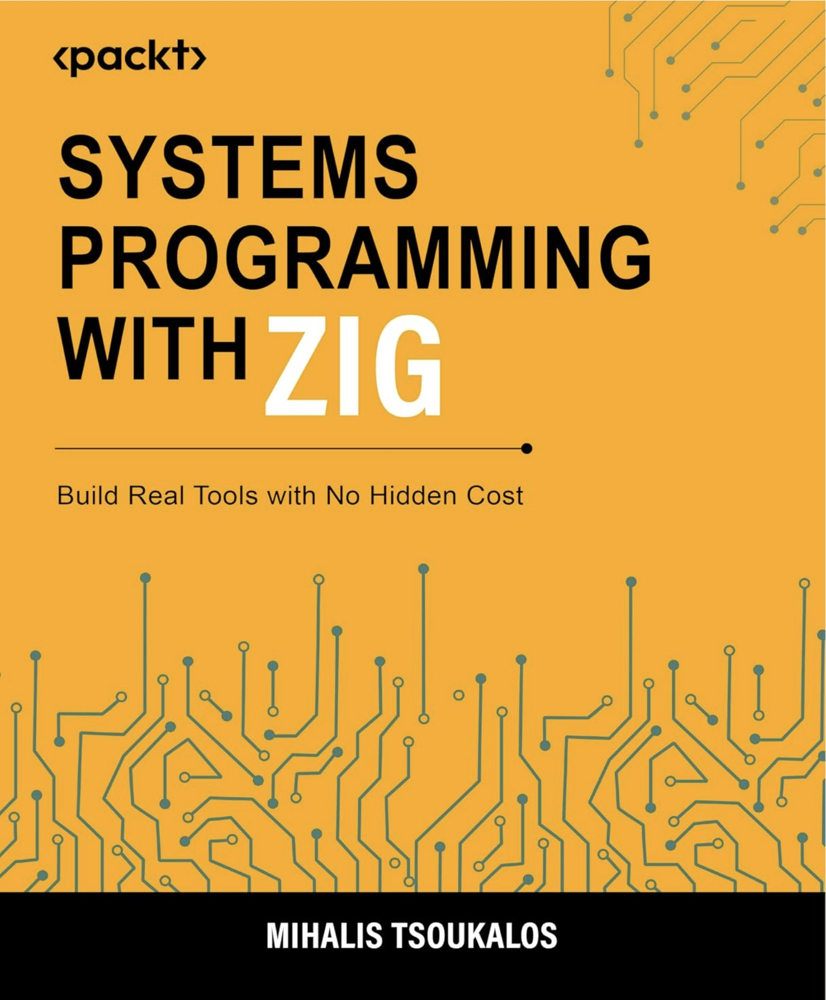

# Systems Programming with Zig

## Table of Contents

1. [Building Essential UNIX Tools](#chapter-1--building-essential-unix-tools)
2. [Systems Infrastructure: Builds, Testing and Distribution](#chapter-2--systems-infrastructure-builds-testing-and-distribution)
3. [Direct Memory Access and Binary Formats](#chapter-3--direct-memory-access-and-binary-formats)
4. [Processing Streams, Buffers and Data Encoding](#chapter-4--processing-streams-buffers-and-data-encoding)
5. [Navigating Directories and Filesystem Events](#chapter-5--navigating-directories-and-filesystem-events)
6. [Programming the Network Stack](#chapter-6--programming-the-network-stack)
7. [Managing Threads, Processes and Signals](#chapter-7--managing-threads-processes-and-signals)
8. [Orchestrating Concurrency and Synchronization](#chapter-8--orchestrating-concurrency-and-synchronization)
9. [Implementing Asynchronous I/O](#chapter-9--implementing-asynchronous-io)
10. [Building a High-Performance In-Memory Cache Server](#chapter-10--building-a-high-performance-in-memory-cache-server)
11. [Persisting Structured Data with SQLite3](#chapter-11--persisting-structured-data-with-sqlite3)
12. [Developing a Domain Specific Language](#chapter-12--developing-a-domain-specific-language)

---

### Chapter 1 — Building Essential UNIX Tools

Puts Zig to work immediately by building three real UNIX utilities: `ztee`, a `tee(1)` clone; `zwhich`, a `which(1)` clone; and `zpass`, which demonstrates calling C code directly via `@cImport()`. Assumes working fluency with Zig and establishes the book's hands-on, tool-building approach from the first page.

---

### Chapter 2 — Systems Infrastructure: Builds, Testing and Distribution

Treats the build process as a first-class systems programming concern. Covers `build.zig`, string formatting with `std.fmt`, memory allocators, unit testing with `std.testing`, the development of `zuuid` and publishing packages using the Zig build system.

---

### Chapter 3 — Direct Memory Access and Binary Formats

Bridges the gap between abstract variables and the physical machine. Covers pointer arithmetic, custom allocator design, endianness handling and binary file parsing, culminating in `zunzip`, a fully functional Zip file lister built from raw bytes. Closes with allocator benchmarks that connect architectural choices to real-world performance.

---

### Chapter 4 — Processing Streams, Buffers and Data Encoding

Shifts focus to I/O efficiency and stream processing through a suite of classic UNIX tools: `zcat`, `zwc` and `z64` for Base64 encoding and decoding. Examines buffering strategies, the cost of system calls, SIMD-accelerated data processing and bitwise encoding logic.

---

### Chapter 5 — Navigating Directories and Filesystem Events

Explores filesystem interaction at the level of OS primitives. Builds `ztree`, a recursive directory tree visualizer, and `zwatch`, a real-time file monitoring utility backed by Linux `inotify` or BSD `kqueue`. Concludes with implementations of `chmod(1)` and `chown(8)`.

---

### Chapter 6 — Programming the Network Stack

Works up from raw TCP/IP sockets to a complete System Monitor API. Builds a TCP echo server and client, a UDP echo server and client, Docker images for network services and a minimal HTTP server and client. Closes by showing how `comptime` can enforce protocol correctness at compile time.

---

### Chapter 7 — Managing Threads, Processes and Signals

Gives direct access to the OS process model through Zig's C interoperability layer. Covers UNIX signal handling, process creation with `fork(2)` and `execve(2)`, shell command execution and a concurrent TCP server and client. All concepts converge in `zcron`, a minimal `cron(8)`-style job scheduler.

---

### Chapter 8 — Orchestrating Concurrency and Synchronization

Examines the distinction between concurrency and parallelism and the practical consequences of getting it wrong. Covers mutexes, atomic operations, condition variables, thread pools, ring buffers and the Producer-Consumer pattern, culminating in `zlocate`, a concurrent file indexer using the Scatter-Gather pattern.

---

### Chapter 9 — Implementing Asynchronous I/O

Addresses the fundamental scalability problem of synchronous I/O under high concurrency. Introduces Zig 0.16's async and await model, builds an asynchronous TCP proxy and includes platform-specific coverage of `io_uring` on Linux and `kqueue` on macOS.

---

### Chapter 10 — Building a High-Performance In-Memory Cache Server

Constructs `zcache`, a non-trivial in-memory cache built around three cleanly separated layers: an LRU storage engine, a custom binary wire protocol (ZEMP) and a thread-per-connection server. Develops three client tools that verify correctness, demonstrate usability and measure throughput and latency.

---

### Chapter 11 — Persisting Structured Data with SQLite3

Moves from in-memory to persistent storage. Covers JSON reading and writing, parsing structured data into Zig types and connecting to SQLite3 through the C interoperability layer. Builds a complete note-taking service with an HTTP API and a dedicated client.

---

### Chapter 12 — Developing a Domain Specific Language

Closes the book by building `zcalc`, a small interpreted programming language, from scratch. Implements all three pillars of an interpreter — a Lexer, a Parser and a tree-walking Evaluator — and wraps them in an interactive REPL. A fitting capstone that draws on every technique introduced across the book.

